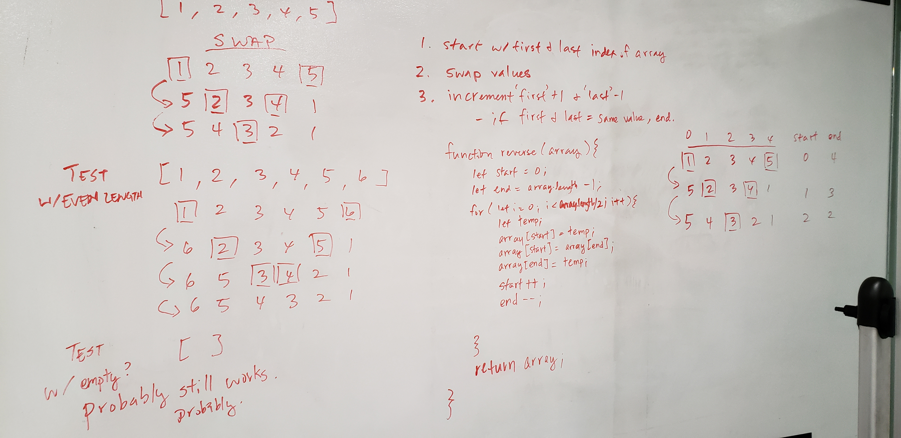

# Reverse an Array
Reverse an array using a basic for loop and without using array methods.

## Challenge
The function should check if an array was passed in.
The function should be able to reverse the array in place.
The function should reverse any length of array, including an empty array.

## Approach & Efficiency
The function works by using two variables representing the first and last index of the array.
A for loop runs through the array swapping the values between the two variables and then incrementing the variables closer to each other with each loop. The loop runs for the array length halved.

## Solution

