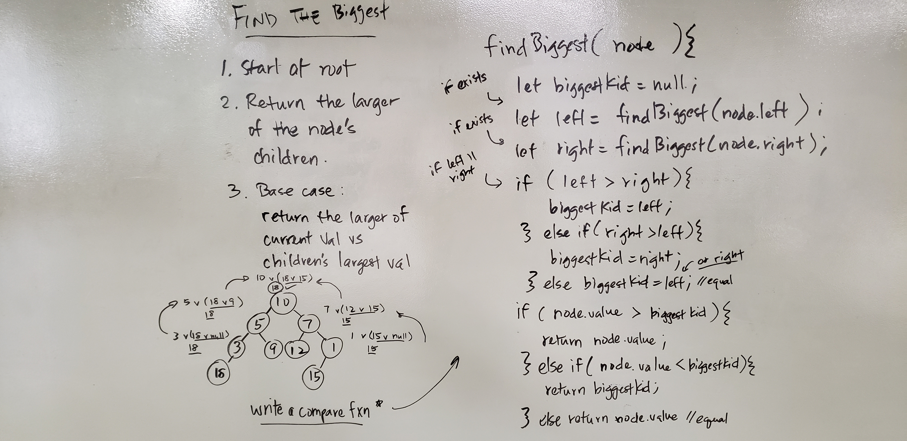

## Binary Tree - Find the Biggest Value

Given a binary tree root, find the biggest value

## Challenges

Assume that all values will be numeric and there will be no numbers 0 or less.

## Approach and Efficiency

- [x] Finds the biggest number given a binary tree
- [x] Finds the biggest number even where duplicate exists

/ Approach /

Using recursion, traverse the tree:
 - In each node determine the largest value from each child
 - Compare the two children values
 - Compare the largest of the children values against the current Node's value
 - Return the largest value
   
/ Efficiency /

Time: O(n), where n is the total number of nodes in the tree. Because we are looking for the largest value in a non-sorted tree, we have to search the entire tree.
Space: O(H), because the function traverses the tree recursively it will add to the call stack for each recursive iteration.

## Whiteboard

