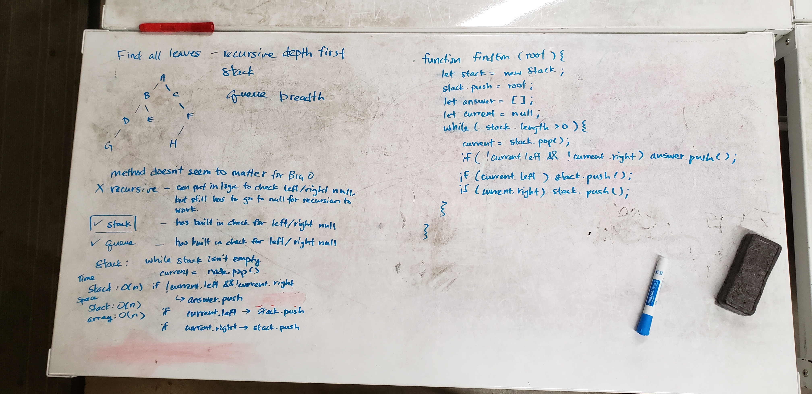

# Find distance between two nodes
Find all leaf nodes on a tree

## Approach & Efficiency
 - Use a stack to traverse the tree
 - Push root into stack
 - While stack has frames
  - Pop the stack and check if the returned node is childless
    - If yes, push node into answer list
    - If no, push any existing children into the stack
 - After while loop has run through the tree, return the answer list

## Whiteboard

