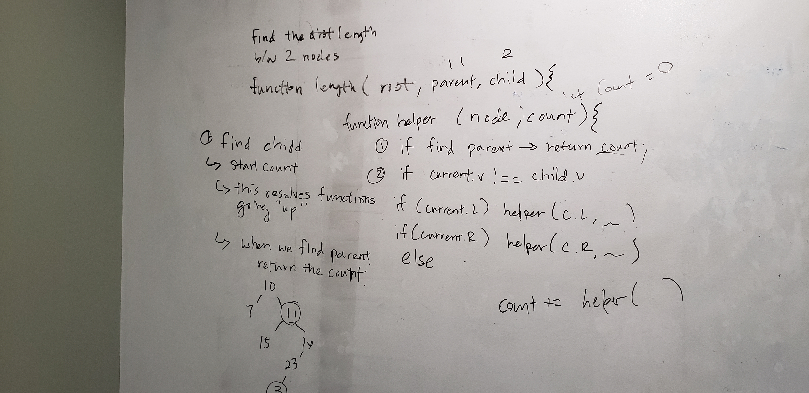

# Find distance between two nodes
Given the parameters: root of a tree, parent value, child value
Write a function that determines the distance between two nodes.

## Approach & Efficiency
1. function findLength ( root, parent, child )
2. Eliminate edge cases: if root, parent, or child is null return null.
3. Find the parent node
  - base case: if found, run helper function to recursively search for target child node
  - recursive: if not found, call this function twice for the current node .left and .right
4. function findChildDistance ( node, child, currentLength )
  - base case: if current node is null, return null.
  - base case: if current node.value is equal to child's value, return currentLength.
  - recursive: call this function twice for .left and .right and pass in currentLength + 1.

Tail Method - 
4. function findChildDistance ( nod, child )
  - base case: if current node is null, return null
  - base case: if current node.value is equal to child's value, return 0.
  - recursive: call this function twice for .left and .right, adding 1 to the returned value of these functions.

## Whiteboard

