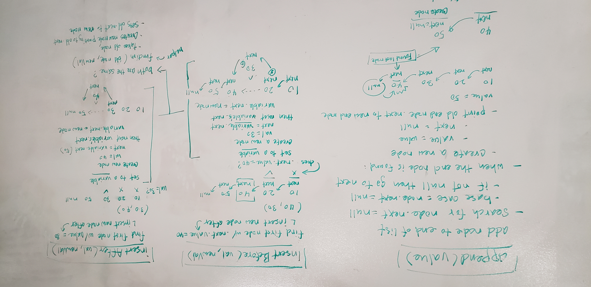

# Linked List
Implement a linked list.

## Challenge
The list should have methods that:

1.  Can insert new nodes
    Can check if it includes a value
    Can output its list in a string

2.  Can search and insert a node before or after a node with a given value
    Can append a node to the end of the list

3.  Given a parameter k, write a function that returns the node k nodes from the end node.

## Approach & Efficiency
1.

  -[x] Can successfully instantiate an empty linked list
  -[x] Can properly insert into the linked list
  -[x] The head property will properly point to the first node in the linked list
  -[x] Can properly insert multiple nodes into the linked list
  -[x] Will return true when finding a value within the linked list that exists
  -[x] Will return false when searching for a value in the linked list that does not exist
  -[x] Can properly return a collection of all the values that exist in the linked list

  /Approach/

  insert( value )
  1) If this.head is null, create a new node with value and set it to this.head and end function. Otherwise, create a new       node with value.
  2) Set the node.next to this.head.
  3) Set this.head to the newly created node.

  includes( value )
  1) Define a currentNode and set to this.head.
  2) Traverse through the list in a while loop.
  3) If the currentNode.value = target value, return true, false if while loop ends without finding the value.

  toString()
  1) Define a currentNode and set to this.head. Init an empty array.
  2) Traverse through the list with currentNode and push each node's value into the array.
  3) .join the array and return the result.

2.

  -[x] Can successfully insert a node before a node located i the middle of a linked list
  -[x] Can successfully insert a node before the first node of a linked list
  -[x] Can successfully insert after a node in the middle of the linked list
  -[x] Can successfully insert a node after the last node of the linked list

  /Approach/

  append( value )
  1) If list is empty, create a new Node with value and set it to this.head.
  2) Init a currentNode and traverse the list in a while loop.
  3) If in the while loop the currentNode.next = null then we know we've reached the end.
  4) Create a new node with value as the newTail. Set currentNode.next to equal newTail.

  insertBefore( oldValue, newValue )
  1) If list is empty, create a new Node with value and set it to this.head.
  2) Init a currentNode and traverse the list in a while loop.
  3) If in the while loop the currentNode.next.value = oldValue, then create a new node with newValue.
  4) Set the new node.next to the currentNode.next. Set currentNode.next to the new node.

  insertAfter( oldValue, newValue )
  1) If list is empty, create a new Node with value and set it to this.head.
  2) Init a currentNode and traverse the list in a while loop.
  3) If in the while loop the currentNode.value = oldValue, then create a new node with newValue.
  4) Set the new node.next to currentNode.next. Set currentNode.next to the new node. 

3.

  -[x] Where k is greater than the length of the linked list
  -[x] Where k and the length of the list are the same
  -[x] Where k is not a positive integer
  -[x] Where the linked list is of a size 1
  -[x] “Happy Path” where k is not at the end, but somewhere in the middle of the linked list

  /Approach/

  countBack( k )
  1) If k < 0 return null.
  2) Traverse the the list with a tracer node.
  3) After k iterations, create (release) a hounds node and have it traverse in parallel with the tracer node.
  4) Allow the loop to finish. Return the hound node.value.

## Solution

