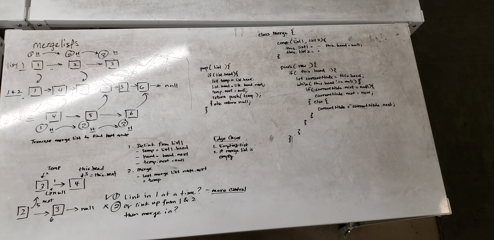

# Linked List
Merge two linked lists

## Challenge
The function should merge two linked lists of any size starting from the first list.

## Approach & Efficiency

-[x] Returns null if both lists empty
-[x] Returns list 2 if list 1 empty
-[x] Returns list 1 if list 2 empty
-[x] Merges equally sized lists
-[x] Merges where second list is larger
-[x] Merges where first list is larger

/ Approach /

- Go through each list, setting anchors at the head of each list.
  - Delink the current anchor from its current list and point its .next to the next anchor.
  - Switch lists and repeat.
- When one list ends, return the first list (it's always the head of the list).

## Whiteboard

