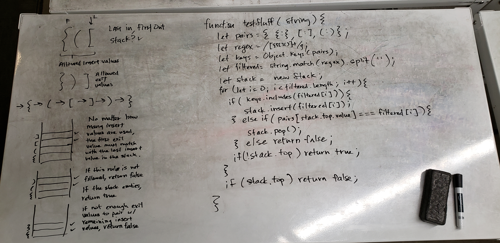

# Multi Bracket Validator
Validate if brackets are in order

## Challenge
Take any string and verify if the brackets are matched correctly in correct order with no unmatched brackets.

## Approach & Efficiency

-[x] Validates empty string to false
-[x] Validates to false if no valid openers or closers
-[x] Validates to false if only openers or closers
-[x] Validates to true with good mixed input
-[x] Validates to false with bad mixed input
-[x] Validates to false with technically good input, but still bad

/ Approach /

- There can be any number of opening brackets as long as they are matched.
  - This works on a LIFO basis so a stack is appropriate to use here.
- Check if string is not empty, and has valid characters.
- Filter the string down to valid characters.
- Run through the string
  - Push any number of open bracket types into a stack.
  - If current index is a closing bracket then check if it pairs with the stack's top value.
  - If a closing bracket is received before the any opening brackets, return false.
  - If there more openers than closers or vice versa, return false.

## Whiteboard

