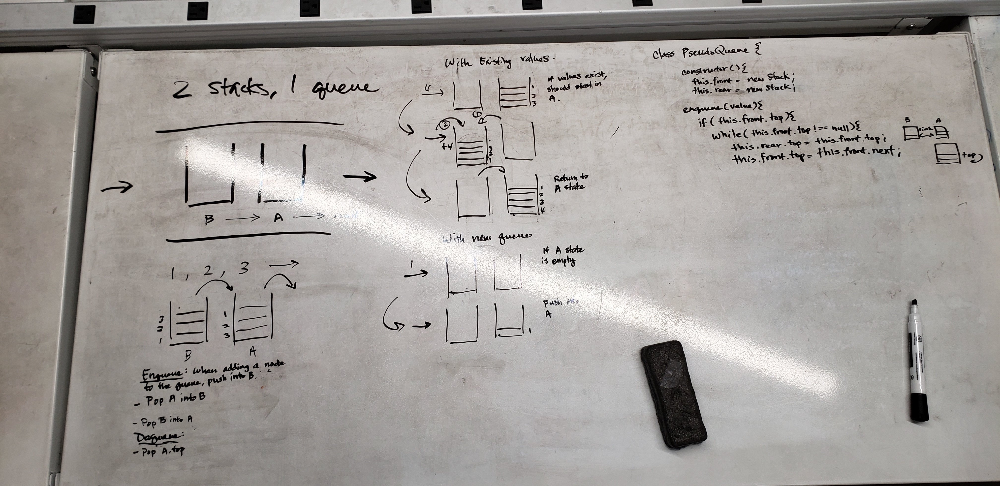

#401 2 Stacks 1 Queue

## Queues with Stacks

Use LIFO to implement FIFO

## Challenges

PseudoQueue class should simulate a queue using two Stacks.

Methods
- Enqueue
- Dequeue

## Approach and Efficiency

- [x] Enqueue enqueues with a empty stacks
- [x] Enqueue enqueues with existing rear stack
- [x] Dequeue dequeues with empty stacks
- [x] Dequeue dequeues with empty front stack
- [x] Dequeue dequeues with existing front and back stack

/ Approach /

New values will enqueue by pushing onto rear stack.
Values will dequeue depending on two scenarios:
  1 Front stack is empty
   - Push the entirety of the rear stack into the front stack
   - Pop the rear stack after every push into the front stack
   - Pop the front stack
  2 Front stack is not empty
   - Pop the front stack

## Whiteboard

