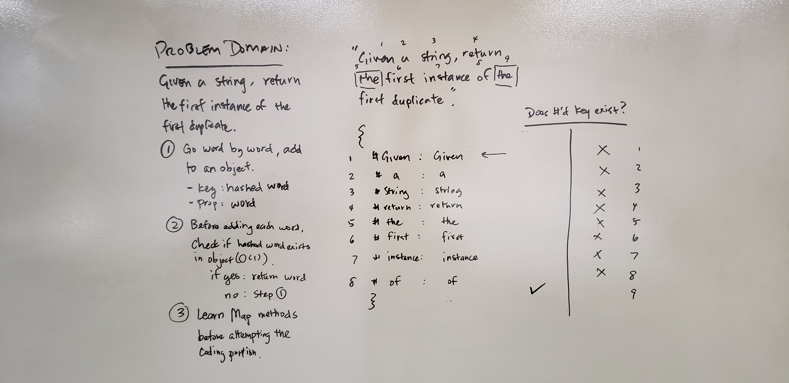

#401 Repeated Words

## Repeat Words

Write a function that takes a string and returns the first instance of a duplicate word.

## Challenges

Use an efficient approach. (failed)

## Approach and Efficiency

- [x] Rejects invalid inputs
- [x] If no duplicates returns original string
- [x] Returns the first instance of a duplicate

/ Approach /

1. Split the string into an array.
    - Time: O(n) Using the split method on a string runs through the length of the string.
    - Space: O(n) Using the split method creates an array equal to the number of words in the string.
2. Run through the array of words
    - Time: O(n) Worst case scenario the duplicate will be at the end of the array.
    a. Check if the word exists in word container object
        If yes, return word
        If no, add to word container object
            - Space: O(n) Worst case scenario the duplicate will be at the end of the array which will make the object as long as the array.

## Whiteboard

;
