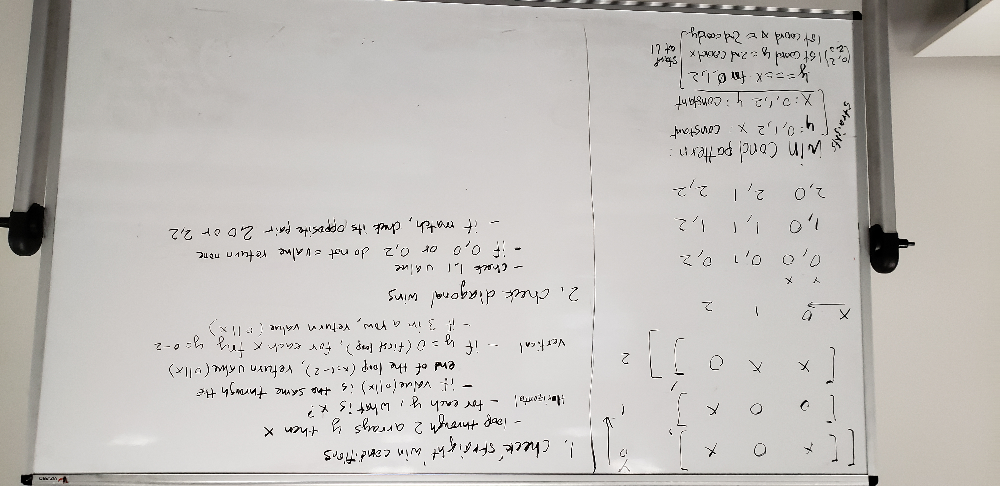

# TicTacToe
Given a finished tic tac toe game, determine if x or o won, or if no one won.

## Approach & Efficiency
1. Determine if there are any horizontal wins
 - Given the first value of each row, does the opposite value exist in the same row?
  - If opposite value does not exist, return value.
2. For the first row only, run an inner loop over each index.
 - Determine if there are any diagonal wins
  - If current index of inner row is 0 or 2 (top corners)
   - If opposite bottom corner and middle value all equal, return value
 - Determine if there are any vertical wins
  - Holding the current index constant, check if next two row values at this index is the same as current value
   - If true, return value
3. If after all checks have run, return none.

## Whiteboard
